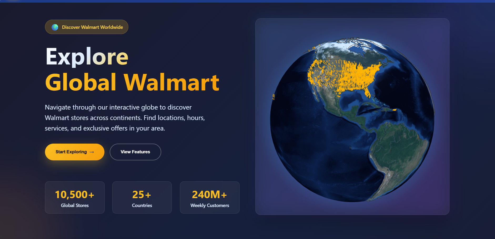

# 💼 WalmartWise

**WalmartWise** is an interactive, visually rich web platform that reimagines the in-store experience at Walmart. From exploring stores across the globe to navigating aisle-level layouts and real-time local insights, WalmartWise offers a smart, immersive shopping assistant.

---

## Preview

### 🔹 Homepage


### 🔹 Store Layout View


### 🔹 Local Insights


---

## Features

### Global Store Exploration
- Interactive **3D Globe** using `react-globe.gl`
- Click on countries to explore Walmart presence
- Glow effects and country detection

### Smart Store Layout Navigation
- **Zoomable, interactive store layouts**
- Category-wise shopping zones: Electronics, Grocery, Furniture, etc.
- 2D/3D toggle view
- Click-to-highlight sections
- Step-by-step shopping **path planner**
- Real-time estimated shopping time

### Intelligent Search
- Search by **product, category, or store area**
- Auto-opens relevant section and highlights matching product
- Works with partial keywords too

### Local Insights
- Visual **cards** showing:
  - Popularity/Crowd level
  - Ongoing Offers
  - Recent Search Trends
- **Grid view** for quick glance (no map fatigue)

### Google Authentication
- Sign in with Google
- Personalized store view per user

### UI & UX
- Glowing effects, smooth transitions
- Responsive design for all screen sizes
- Light/dark backgrounds with animated layouts

---

## Tech Stack

| Frontend               | Backend              | Other Services            |
| ----------------------| -------------------- | ------------------------- |
| React + Vite / CRA     | Express.js + Node.js | Google OAuth 2.0          |
| Tailwind CSS / CSS     | MongoDB (optional)   | REST APIs                 |
| react-globe.gl + D3.js | JWT / Session-based  | Netlify / Vercel / Render |
| Material UI            |                      |                           |

---

## Getting Started

### 1. Clone the Repo

```bash
git clone https://github.com/your-username/walmartwise.git
cd walmartwise
````

### 2. Install Dependencies

```bash
npm install
```

### 3. Set up Environment Variables

Create a `.env` file in the root of the project with the following:

```env
REACT_APP_BACKEND_URL=http://localhost:5000
```

For backend (inside `/backend/.env`):

```env
GOOGLE_CLIENT_ID=your-google-client-id
GOOGLE_CLIENT_SECRET=your-client-secret
SESSION_SECRET=your-random-secret
```

### 4. Start the App

#### Frontend

```bash
npm start
```

#### Backend

```bash
cd backend
npm install
npm run dev
```

---

## API Endpoints

| Method | Endpoint         | Description          |
| ------ | ---------------- | -------------------- |
| GET    | /api/auth/check  | Check login status   |
| GET    | /api/auth/google | Trigger Google OAuth |
| POST   | /api/auth/logout | Log out current user |

---

## 🗂 Folder Structure (Important)

```
walmartwise/
├── public/
├── src/
│   ├── components/
│   │   ├── GlobeView.jsx
│   │   ├── StoreLayout.jsx
│   │   ├── LocalInsightsPage.jsx
│   │   └── ...
│   ├── pages/
│   │   ├── LoginPage.jsx
│   │   ├── Dashboard.jsx
│   │   └── StoreLayoutPage.jsx
│   ├── App.js
│   └── index.css
├── backend/
│   └── (Express app files)
```

---

## Developer Notes

* Store layout data is JSON-defined with grid mapping.
* Local insights are mock-fed for now (real-time data integration WIP).
* Search is keyword-mapped to both sections and product data.
* Optimized for smooth user transitions and path suggestions.

---

## Contributing

Contributions and ideas welcome!

```bash
git checkout -b new-feature
git commit -m "✨ Added feature"
git push origin new-feature
```

---

## License

This project is licensed under the [MIT License](https://opensource.org/licenses/MIT).

---
